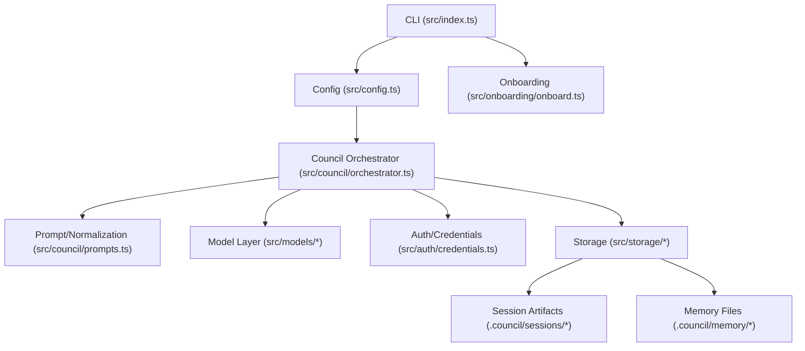

# System Overview

This project runs a structured multi-agent "council" over a user prompt and can emit:

- a deliberation transcript and event log
- a leader summary
- optional output artifacts (for example, documentation markdown)
- optional execution handoff metadata

## Runtime Flow

1. CLI parses command and options (`run` or `onboard`).
2. Config is loaded and validated.
3. On `run`, orchestrator starts a new session:
   - leader election
   - enter phase graph at `sessionPolicy.entryPhaseId`
   - round-robin discussion within each configured phase
   - motion seconding
   - blind voting
   - transition selection from configured phase graph
   - optional documentation review loop (draft, approval vote, blocker feedback, revision, re-vote)
   - finalization
4. Session events are written incrementally and memory is refreshed at close from session outcomes.
5. Session artifacts are written to `.council/sessions/<session_id>/`.

Round-robin details:
- Turn order is fixed per session (`turnOrder` or member declaration order).
- Each phase executes full rounds where every member receives one turn.
- A phase closes by majority vote or by hitting its phase round cap.
- Next phase is selected via transition rules (`MAJORITY_VOTE`, `ROUND_LIMIT`, `ALWAYS`) and fallback policy.

## High-Level Architecture

## Core Design Decisions

- Odd council size and per-phase configurable voting thresholds.
- Phase-graph deliberation with per-phase rounds, deliverables, quality gates, and fallback/transition policy.
- Documentation artifacts use a bounded council review loop before final approval.
- Deterministic fallbacks for non-JSON model output.
- Fail-fast for transport/auth/provider errors.
- Human approval gate for execution handoff.
- Credentials stored locally in gitignored files and referenced by ID.
