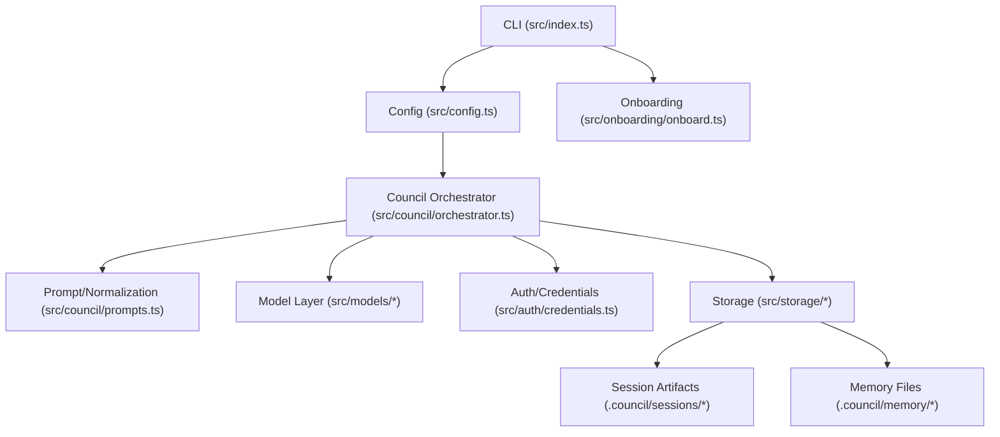

# System Overview

This project runs a structured multi-agent "council" over a user prompt and can emit:

- a deliberation transcript and event log
- a leader summary
- optional output artifacts (for example, documentation markdown)
- optional execution handoff metadata

## Runtime Flow

1. CLI parses command and options (`run` or `onboard`).
2. Config is loaded and validated.
3. On `run`, orchestrator starts a new session:
   - leader election
   - round-robin discussion
   - motion seconding
   - blind voting
   - finalization
4. Session events are written incrementally and memory is refreshed at close from session outcomes.
5. Session artifacts are written to `.council/sessions/<session_id>/`.

## High-Level Architecture

## Core Design Decisions

- Odd council size, majority of full council for pass.
- Deterministic fallbacks for non-JSON model output.
- Fail-fast for transport/auth/provider errors.
- Human approval gate for execution handoff.
- Credentials stored locally in gitignored files and referenced by ID.
